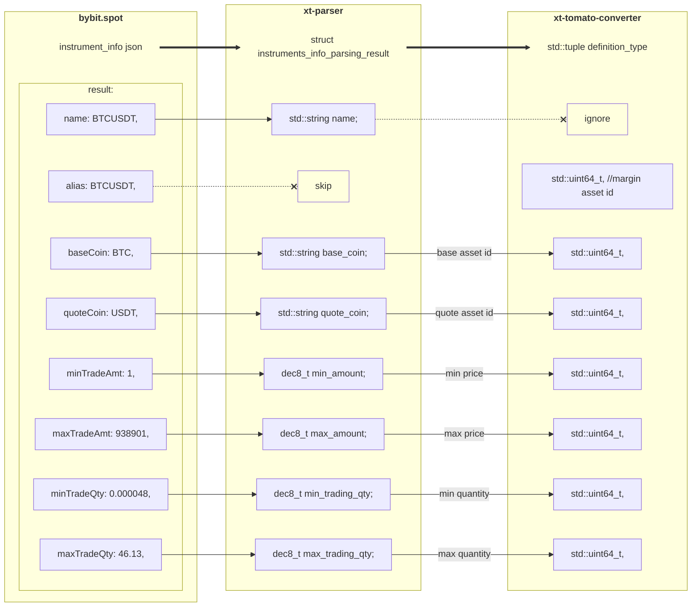

Пример диаграмы mermaid:

```mermaid
flowchart LR

classDef ignore fill:#0000;
classDef bold font-weight:bold;
classDef all fill:#0000,stroke:#0000;

    subgraph bybit[bybit.spot]
        direction TB
        json[instrument_info json]
        subgraph result[result:]
            name[name: BTCUSDT,]
            alias[alias: BTCUSDT,]
            baseCoin[baseCoin: BTC,]
            quoteCoin[quoteCoin: USDT,]
            minTradeQty[minTradeQty: 0.000048,]
            minTradeAmt[minTradeAmt: 1,]
            maxTradeQty[maxTradeQty: 46.13,]
            maxTradeAmt[maxTradeAmt: 938901,]
        end
    end

    subgraph parser[xt-parser]
        direction TB
        struct[struct instruments_info_parsing_result]
            _name["std::string name;"]
            skip_alias[skip]:::ignore
            base_coin["std::string base_coin;"]
            quote_coin["std::string quote_coin;"]
            min_amount["dec8_t min_amount;"]
            max_amount["dec8_t max_amount;"]
            
            max_trading_qty["dec8_t max_trading_qty;"]
            min_trading_qty["dec8_t min_trading_qty;"]
    end

    subgraph converter[xt-tomato-converter]
        direction TB
        tuple[std::tuple definition_type]
            ignore_s[ignore]:::ignore
            margin_asset_id[std::uint64_t, //margin asset id]
            
            base_asset_id[std::uint64_t,]
            quote_asset_id[std::uint64_t,]
            min_price_[std::uint64_t,]
            max_price_[std::uint64_t,]
            min_quantity_[std::uint64_t,]
            max_quantity_[std::uint64_t,]
    end

    json:::all ==> struct:::all ==> tuple:::all
    
    name --> _name -.-x ignore_s
    alias -.-x skip_alias
    baseCoin --> base_coin -->|"base asset id"| base_asset_id
    quoteCoin --> quote_coin -->|"quote asset id"| quote_asset_id
    minTradeQty --> min_trading_qty -->|"min quantity"| min_quantity_
    minTradeAmt --> min_amount -->|"min price"| min_price_
    maxTradeQty --> max_trading_qty -->|"max quantity"| max_quantity_
    maxTradeAmt --> max_amount -->|"max price"| max_price_

    bybit:::bold
    parser:::bold
    converter:::bold
```
